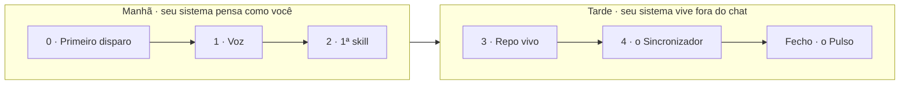

> **MS CREATIVE KEYS** · Dia Um — um dia, duas sessões

# Dia Um

> [!info] O que é esta página
> A porta de entrada express do programa. Em um dia, sua v1 do sistema nasce e roda. As 4 semanas são onde ela ganha profundidade. Manda **DIA-UM** pra entrar.

## O princípio

O programa de 4 semanas é sequencial: você atravessa o fundamento inteiro antes de produzir. **Dia Um** inverte. Você não monta o fundamento pra depois produzir — você produz no dia 1, e o fundamento se empilha em cima do que já roda.

No fim do dia, a v1 do seu sistema está no ar: sua voz instalada, uma skill rodando, um repo vivo, **o Sincronizador** mantendo o repo em dia sozinho. Não é atalho pra fugir do programa. É a porta que coloca algo vivo na primeira sessão e depois te entrega pras 4 semanas.

**DIA-UM** é a senha da experiência: a palavra que você manda pra entrar, e o crachá que você carrega quando termina.

## O que o dia entrega — e o que adia

**Entrega:** Claude na sua voz · 1 skill rodando · 1 repo GitHub com seu sistema dentro · **o Sincronizador** (rotina que mantém o repo em dia sozinha) · 1 tarefa real rodada ponta a ponta.

**Adia (vem nas 4 semanas):** fundamentos de IA a fundo, pipeline de voz completo, token router, workflows vs agents, prompt evaluation, MCP, catálogo de rotinas.

Vender "um dia resolve tudo" como troca pelas semanas seria mentira. "Em um dia seu sistema nasce e roda" é verdade.

---

## O dia — duas sessões, 6 blocos

O dia parte em dois ganhos fechados, pra caber sem maratona. Crie uma pasta `MD-FILES/` (sugestão `~/MD-FILES/`); tudo do dia vive nela até virar repo na tarde. Os prompts pra copiar estão em **Prompts** (links em cada bloco).

### Manhã — seu sistema pensa como você (~3,5h)

**Bloco 0 — Primeiro disparo · 30 min.** Em vez de teoria antes de produzir, o dia abre produzindo. Dispare um prompt que já carrega contexto, veja sair algo aproveitável, e só então olhe pra trás. Você deu **contexto**, não só ordem; veio em **markdown**; e o que ele errou mostra os **limites** — não peça dado em tempo real, conta exata, nem decisão por você. No fim: **você já tem seu primeiro rascunho usável** — a primeira vitória do dia, antes de instalar qualquer coisa.

→ Prompts: [[Prompts/Bloco 0 · Primeiro disparo|Bloco 0 · Primeiro disparo]]

**Bloco 1 — Claude na sua voz · 90 min.** Junte 2-3 textos reais seus. Rode o WRITEPRINT, escreva `about-me.md` e `writing-style.md` (5 seções; a lista *evitar* vale mais que a *usar*). Teste num chat novo: "descreve como sou profissionalmente". Saiu você? Use numa tarefa real hoje — primeira batida no Pulso.

→ Prompts: [[Prompts/Bloco 1 · Claude na sua voz|Bloco 1 · Claude na sua voz]]

**Bloco 2 — Sua primeira skill · 130 min.** Skill = receita pré-pronta que o Claude ativa sozinho. Liste 5+ tarefas que você já fez 3+ vezes; a de padrão mais claro é a de hoje. Preencha o esqueleto: description (o roteador), procedimento acionável, casos de borda. Instale e teste num chat novo — segunda batida no Pulso.

→ Prompts: [[Prompts/Bloco 2 · Sua primeira skill|Bloco 2 · Sua primeira skill]]

### Tarde — seu sistema vive fora do chat (~2,5h)

**Bloco 3 — Seu repo vivo · 90 min.** Tire o sistema de dentro do chat. Crie um repo `md-files` no GitHub (Private), clone com o GitHub Desktop, copie seu contexto e sua skill pra dentro, commit + push. Peça ao Claude um plano de organização (sem executar), aprove, deixe ele mover (nunca apagar). A ponte pro Bloco 4: o repo existe, mas você ainda alimenta à mão — e a chave da automação é uma trava chamada gate de SHA.

→ Prompts: [[Prompts/Bloco 3 · Seu repo vivo|Bloco 3 · Seu repo vivo]]

**Bloco 4 — o Sincronizador · 60 min.** **o Sincronizador** dispara no horário, compara sua pasta local com o repo, aponta o drift, puxa o que é seguro — e **nunca apaga sem o gate de SHA confirmar**. Painel Routines → New routine → camada Desktop task → agenda → Run now pra testar. **Confira o fuso antes de salvar.** Terceira batida no Pulso.

→ Prompts: [[Prompts/Bloco 4 · o Sincronizador|Bloco 4 · o Sincronizador]]

**Fecho · 20 min.** A última tarefa do dia é meta: gere o seu **post de conclusão** pelo próprio sistema que você acabou de montar — contexto carregado, skill se couber, resultado na sua voz. Publique com o crachá DIA-UM. O post prova o sistema, e o sistema assina o post. Marque **o Pulso** em 3/3 → [o Pulso](pulso.html). Está vivo.

Cada bloco fecha com um **exercício e um critério binário de "feito"** — pra você saber que rodou de verdade, não só que entendeu.

---

## o Pulso — o score

Não mede "quão pronto você está". Mede o que você fez rodar. **o Pulso** bate em três: **tarefas reais rodadas** + **skills criadas** + **rotinas no ar**. Você marca cada batida ao vivo no tracker → [o Pulso](pulso.html), de 0/3 a 3/3. Um dia bem feito fecha com pelo menos 1 em cada. Não há nota de "completo". Há "está vivo e crescendo".

> [!tip] Sua v1 está no ar — e o próximo passo
> Amanhã de manhã, o roteiro é o [Dia Dois](dia-dois.html): quinze minutos, quatro passos, a prova de que o sistema trabalha sem você. E quando o trabalho de verdade chegar, abre o [Pack · Prompts de Bancada](pack-prompts.html): 10 prompts prontos, um pra cada tarefa que você repete toda semana, calibrados pra rodar com a sua voz carregada.
> Daqui você evolui pra sempre. **Prompt Zero** é onde cada peça que você pôs no ar hoje vira fundamento: 4 semanas guiadas, 1 ano de acesso, em cima do que já roda. E o **valor que você pagou no Dia Um vira crédito no Prompt Zero** — a porta de entrada abate no programa, você não paga duas vezes.
